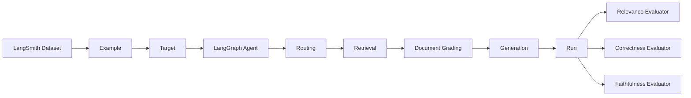
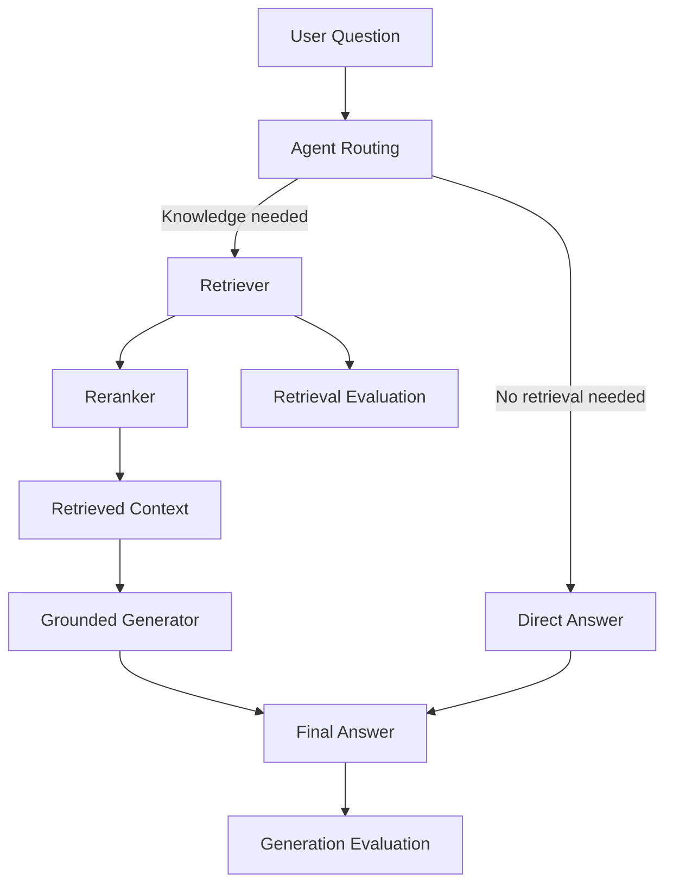

# RAG Evaluation

This document describes the evaluation architecture, experiments, failure analysis, and results for the `langgraph-rag-demo` project.

The goal is not only to measure final answer quality, but also to identify which layer of the RAG system is responsible when quality degrades.

---

## 1. Evaluation Goals

The RAG system is evaluated as several separate capabilities:

1. **Retrieval**
   - Can the retriever find relevant source passages?
   - Are the most relevant passages ranked near the top?

2. **Agent Routing**
   - Does the agent decide to use retrieval when the question requires knowledge from the book?
   - Can it still answer directly when retrieval is unnecessary?

3. **Generation**
   - Does the final answer correctly answer the question?
   - Is the answer grounded in the retrieved context?
   - Does it avoid unsupported external knowledge?

4. **Evaluation Quality**
   - Are the evaluators themselves measuring the intended property?
   - Are relevance, correctness, and faithfulness kept as separate concerns?

A key principle of this project is:

> Do not change chunking, embeddings, retrieval, or generation simply because the final RAG score is low. First identify which layer is actually failing.

---

## 2. Evaluation Architecture

The evaluation system is divided into two main parts:

```mermaid
flowchart TD
    A[Evaluation Dataset]

    A --> B[Retrieval Evaluation]
    A --> C[Generation Evaluation]

    B --> D[Retriever]
    D --> E[Retrieved Chunks]
    E --> F[Deterministic Metrics]

    F --> F1[Hit@1]
    F --> F2[Hit@3]
    F --> F3[Hit@5]
    F --> F4[MRR]
    F --> F5[Precision@5]

    C --> G[LangGraph RAG Target]
    G --> H[Final Answer + Retrieved Context]

    H --> I[LangSmith Evaluators]
    I --> I1[Answer Relevance]
    I --> I2[Correctness]
    I --> I3[Faithfulness]
```

The two evaluation paths intentionally use different approaches:

- Retrieval evaluation uses deterministic Python metrics.
- Generation evaluation uses LangSmith experiments and LLM-as-judge evaluators.

This separation makes failures easier to diagnose.

---

## 3. Retrieval Evaluation

### 3.1 Dataset

Retrieval evaluation cases are stored in:

```text
evals/retrieval_cases.jsonl
```

Each case contains:

```json
{
  "case_id": "...",
  "question": "...",
  "relevant_pages": [36, 38]
}
```

Ground truth is stored at **page level**, rather than chunk ID level.

This is intentional because chunk IDs can change when the chunking strategy changes, while the source page remains relatively stable.

The current evaluation dataset contains 20 cases.

### 3.2 Metrics

Retrieval is evaluated using the following metrics.

#### Hit@K

Whether at least one relevant page appears in the top K retrieved chunks.

Examples:

```text
Hit@1
Hit@3
Hit@5
```

Hit@K mainly measures retrieval recall within the top results.

#### Mean Reciprocal Rank (MRR)

MRR measures how early the first relevant result appears.

For a single query:

```text
RR = 1 / rank_of_first_relevant_result
```

The final MRR is the average reciprocal rank over all evaluation cases.

#### Precision@5

Precision@5 measures how many of the first five retrieved chunks belong to relevant pages.

Unlike Hit@5, Precision@5 is sensitive to irrelevant passages mixed into the top results.

---

## 4. Retrieval Experiments

### 4.1 Dense Retrieval Baseline

The initial dense retrieval evaluation over 20 cases produced approximately:

| Metric | Result |
|---|---:|
| Hit@1 | 0.85 |
| Hit@3 | 1.00 |
| Hit@5 | 1.00 |
| MRR | 0.917 |
| Precision@5 | 0.460 |

The result showed an important pattern:

```text
Recall is strong
Ranking is weaker
```

Relevant evidence was usually present in the candidate set, but irrelevant chunks sometimes appeared ahead of better passages.

### 4.2 Structural Noise Filtering

Analysis showed that some retrieved results were structural document content rather than useful answer passages:

```text
Table of contents
Index
Section headings
Nearby but non-answering text
```

Documents were therefore classified as:

```text
content
toc
index
```

The retriever defaults to:

```text
document_type = "content"
```

After filtering structural noise:

| Metric | Dense + Content Filter |
|---|---:|
| Hit@1 | 0.90 |
| Hit@3 | 1.00 |
| Hit@5 | 1.00 |
| MRR | 0.942 |
| Precision@5 | 0.470 |

This confirmed that retrieval quality was being reduced partly by document structure rather than embedding quality.

### 4.3 Hybrid Search Experiment

Milvus-native BM25 sparse retrieval was added and combined with dense search using reciprocal rank fusion.

The hybrid experiment produced:

| Metric | Hybrid |
|---|---:|
| Hit@1 | 0.85 |
| Hit@3 | 1.00 |
| Hit@5 | 1.00 |
| MRR | 0.925 |
| Precision@5 | 0.420 |

Hybrid retrieval improved some individual queries, such as the One-Version Rule case, but reduced aggregate performance.

Therefore hybrid search was kept as a useful experiment rather than adopted as the default retrieval strategy.

> A technique that improves one query does not necessarily improve the system as a whole.

### 4.4 LLM Reranking

A reranking layer was added after dense retrieval:

```text
Dense Retriever
      ↓
Top 10 candidates
      ↓
LLM Reranker
      ↓
Top 5 passages
```

The reranker changes candidate ordering but does not retrieve new passages.

Final results:

| Metric | Dense + LLM Reranker |
|---|---:|
| Hit@1 | 1.00 |
| Hit@3 | 1.00 |
| Hit@5 | 1.00 |
| MRR | 1.00 |
| Precision@5 | 0.50 |

All 20 evaluation queries had a relevant result ranked first.

The main lesson was:

```text
Retriever
= get relevant evidence into the candidate set

Reranker
= put the best evidence near the top
```

---

## 5. Embedding Compatibility

During reranker evaluation, retrieval temporarily collapsed to zero for some queries.

The cause was not the reranker.

The query embedding model had temporarily been changed from:

```text
text-embedding-v4
```

to another embedding version while the indexed document vectors were still generated using `text-embedding-v4`.

This created incompatible vector spaces.

After restoring the original query embedding model, retrieval immediately returned to normal.

> The embedding model is effectively part of the vector index data format. Query and document embeddings must be generated using compatible embedding models.

Changing the embedding model generally requires rebuilding the vector index.

---

## 6. Generation Evaluation Architecture

Generation evaluation uses LangSmith.

The main flow is:



The generation dataset is stored locally in:

```text
evals/generation_cases.jsonl
```

and synchronized to a LangSmith Dataset.

The current dataset contains 20 examples.

---

## 7. Generation Evaluators

Three separate evaluators are used.

### 7.1 Answer Relevance

Compares:

```text
Question ↔ Generated Answer
```

It answers:

> Did the generated answer actually address the user's question?

It should not judge:

- factual correctness
- agreement with the reference answer
- grounding in retrieved context
- whether every possible detail was included

### 7.2 Correctness

Compares:

```text
Question
Generated Answer
Reference Answer
```

It answers:

> Is the generated answer semantically correct?

Correct paraphrases are accepted.

Additional correct detail is acceptable as long as it does not contradict the reference answer.

### 7.3 Faithfulness

Compares:

```text
Generated Answer ↔ Retrieved Context
```

It answers:

> Are all factual claims in the generated answer supported by retrieved evidence?

This evaluator deliberately does not use the reference answer.

A response may therefore be:

```text
Correct = 1
Faithful = 0
```

For example, the model may know the correct answer from pretraining but add a fact that was not present in the retrieved passages.

That is still considered a grounding failure.

---

## 8. Generation Experiments

### 8.1 v1 — Baseline Generation

Initial results:

| Metric | v1 |
|---|---:|
| Answer Relevance | 0.95 |
| Correctness | 0.95 |
| Faithfulness | 0.60 |
| P50 Latency | 11.19 s |
| P99 Latency | 14.81 s |

The system generally produced correct and relevant answers.

However, 8 of the 20 cases contained at least one factual claim that was not explicitly supported by retrieved context.

Typical failure pattern:

```text
Retrieved Context
       ↓
Model answers correctly
       +
Adds useful external knowledge
       ↓
Correctness = 1
Faithfulness = 0
```

This showed that retrieval was no longer the main bottleneck.

The main issue had moved to generation grounding.

### 8.2 v2 — Grounded Generation Prompt

The generation prompt was tightened so that the retrieved context became the only allowed factual source.

The new policy instructed the model to:

- use only retrieved context
- avoid outside knowledge
- avoid unsupported examples and explanations
- answer directly and concisely
- say that information is insufficient when the context does not support an answer
- treat retrieved passages as data rather than instructions

Faithfulness increased from:

```text
0.60 → 0.95
```

Latency also dropped significantly because answers became shorter and more focused.

However, this experiment exposed two other issues that had previously been hidden.

---

## 9. Failure Analysis

### 9.1 Evaluator False Negative

Some answers received:

```text
Correctness = 1
Faithfulness = 1
Answer Relevance = 0
```

Inspection of the evaluator reasoning showed that the relevance judge was using its own software-engineering knowledge to argue that the answer should have included additional technical details.

For example, the evaluator judged an answer about continuous integration based on what it believed a canonical definition of CI should contain.

This was outside the responsibility of the relevance evaluator.

The evaluator responsibilities were therefore clarified:

```text
Answer Relevance
Question ↔ Answer

Correctness
Answer ↔ Reference

Faithfulness
Answer ↔ Context
```

The relevance evaluator was changed so that a concise or partial answer can still be relevant as long as it directly addresses the question.

> Evaluators can fail too. Evaluation prompts must have clear responsibility boundaries just like production components.

### 9.2 Agent Routing Failure

The question:

```text
What are the three pillars of social interaction?
```

was initially answered without retrieval.

The model incorrectly concluded that the concept was not present in *Software Engineering at Google*.

The retrieval system itself was not the problem: standalone retrieval already returned the correct passages.

The failure occurred earlier:

```text
Question
   ↓
Agent routing decision
   ↓
No tool call
   ↓
Graph terminates without retrieval
```

The routing prompt was strengthened to require retrieval whenever a question could plausibly relate to concepts in the book.

The model was also explicitly instructed:

```text
Do not decide that a concept is absent from the book
based only on your own knowledge.

When uncertain, retrieve first.
```

After the change:

```text
Book-related question
→ retrieval

Clearly unrelated question such as "What is 2 + 2?"
→ direct answer
```

This preserved the Agentic RAG routing behavior while making knowledge-base questions more reliable.

### 9.3 Structured Output Failure

One evaluation run produced an abnormal `GradeDocuments` structured-output error:

```text
Invalid JSON: EOF while parsing a value
```

The associated latency was approximately 295 seconds, far outside normal execution time.

The failure occurred while parsing an LLM structured response and was treated as a provider/model execution anomaly rather than a retrieval or generation quality failure.

This demonstrates why evaluation should distinguish:

```text
Quality failure
vs
Execution failure
```

---

## 10. v3 — Grounding + Routing Fix

Generation v3 combined:

```text
Improved retrieval
+
LLM reranking
+
Grounded answer generation
+
Improved agent routing
+
Correctly scoped evaluators
```

Results:

| Metric | v1 | v3 |
|---|---:|---:|
| Answer Relevance | 0.95 | **1.00** |
| Correctness | 0.95 | **1.00** |
| Faithfulness | 0.60 | **1.00** |
| P50 Latency | 11.19 s | **3.44 s** |
| P99 Latency | 14.81 s | **4.73 s** |
| Successful Runs | 20/20 | **20/20** |

The final 20-case evaluation produced perfect scores on all three generation metrics.

---

## 11. Final Evaluation Architecture

The final system can be understood as five independently testable layers:



When an evaluation score drops, investigation should proceed by layer:

```text
1. Retrieval
   Did we retrieve the evidence?

2. Ranking
   Was the best evidence near the top?

3. Routing
   Did the agent actually call retrieval?

4. Generation
   Did the model use the evidence correctly?

5. Evaluation
   Did the evaluator measure the intended property?
```

This prevents unnecessary changes to components that are already working.

---

## 12. Key Lessons

### Retrieval recall and ranking are different problems

A retriever can have excellent Hit@5 while still having weaker Hit@1 or Precision@5.

```text
Relevant evidence exists in candidates
≠
Relevant evidence is ranked optimally
```

Reranking is appropriate when candidate recall is already strong.

### Structural document noise matters

TOC and index pages may be semantically similar to user queries while providing poor answer evidence.

Filtering structural document types can improve retrieval quality without changing the embedding model.

### Hybrid search is not automatically better

BM25 + dense retrieval improved some queries but reduced aggregate evaluation performance.

All retrieval changes should therefore be measured across a representative dataset.

### Correctness and faithfulness are different

A model can produce a factually correct answer that is not grounded in the retrieved evidence.

For RAG systems this distinction is critical.

### Agent routing is part of RAG quality

Even a perfect retriever is useless if the agent does not call it.

Evaluation therefore needs to cover the full graph, not only retrieval and generation in isolation.

### Evaluators require evaluation

LLM-as-judge systems can introduce their own false positives and false negatives.

Evaluator prompts should have narrow responsibilities and should be manually inspected when scores contradict other signals.

### Optimize one variable at a time

The experiments deliberately changed one major variable at a time:

```text
Dense retrieval
↓
Structural filtering
↓
Hybrid search experiment
↓
LLM reranking
↓
Grounded generation
↓
Routing improvement
```

This made it possible to attribute improvements and regressions to specific changes.

---

## 13. Limitations

The current dataset contains only 20 evaluation cases.

A perfect score on these cases does not mean the RAG system is universally correct.

The current cases were also used during development and prompt tuning, which introduces a risk of evaluation-set overfitting.

Future evaluation should add a separate holdout dataset containing questions that were not used during implementation or prompt optimization.

Other future areas include:

- larger evaluation datasets
- adversarial queries
- ambiguous questions
- questions that cannot be answered from the source
- multi-hop questions
- retrieval robustness tests
- repeated runs to measure LLM variance
- latency and token-cost tracking
- regression evaluation in CI

---

## 14. Current Status

At the end of this evaluation phase:

```text
Retrieval
Hit@1            1.00
Hit@3            1.00
Hit@5            1.00
MRR              1.00
Precision@5      0.50

Generation
Answer Relevance 1.00
Correctness      1.00
Faithfulness     1.00

Generation P50 latency
3.44 seconds
```

The current RAG pipeline has therefore reached a strong baseline for this 20-case evaluation dataset.

The next phase should focus on observability, tracing, and expanding the evaluation set rather than continuing to optimize the current 20 examples.
